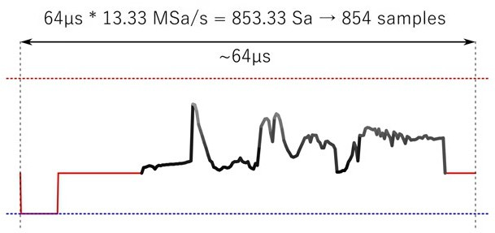

# composit-video-arduino-test

مشروع تجريب لفهم كيفية توليد فيديو لعرضه عبر مخرج الفيديو من نوع composite video  الخاص بالتليفيزيونات 
 
 الشيء الاول المراد فهمه ان موجة عرض الفيديو المرسلة للتلفزيون هو 64 مايكروثانية us 
 

 
الاشارة المرشلة تبداء بموجة مزامنة قيمتها صفر فولت مدتها 4.7 مايكروثانية us
  
 بعدها تاثير اشاشة الفراغ blank و مدتها 4.5/5.7 مايركوثانية وفولتية 0.3V 
  
 اشارة خطوط عرض الصورة تكون بفولتية متبدبة بين 0.3 v - 1.0v

 
 

 

 

 

 

 

