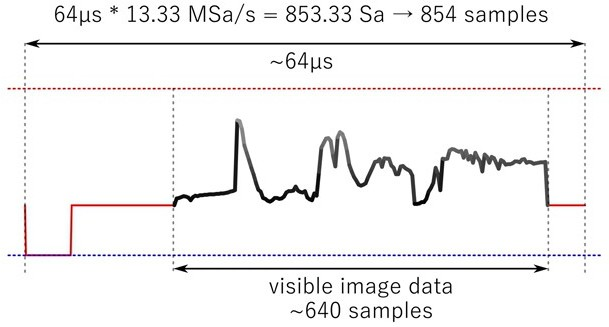
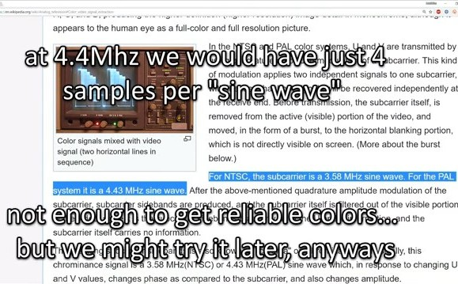

# composite-video-arduino-test

مشروع تجريبي لفهم كيفية توليد فيديو لعرضه عبر مخرج فيديو من نوع composite video الخاص بالتيليفيزيون 
 
    صفحة ويكي المشروع 
 https://github.com/No-Shit/composit-video-arduino-test/wiki
  
الشيء الاول المراد فهمه أن عرض موجة إشارة الفيديو المرسلة للتلفزيون هو 64 مايكروثانية μ64 
 
 تساوي  
65us = 64 ÷ 1000000 = 1 ÷ 0.000064 = 15625 Hz 
 

 
اﻹشارة المرسلة تبداء بموجة مزامنة قيمتها صفر فولت 0V مدتها 4.7 مايكروثانية μ4.7
 
 بعدها تاثير اشاشة الفراغ blank و مدتها 4.5/5.7 مايركوثانية وفولتية 0.3V 
  
 اشارة خطوط عرض الصورة تكون بفولتية متبذبذة بين 0.3v - 1.0v
اشارة انهاء الموجة blank مدتها μ1.6 مايكروثانية بقيمة 0.3V   
  

 
اشارة بيانات الصورة تحتوي على 640 نمودج لمكونات الصورة و هي تدريجات بين اللون الاسود و الابيض .  
   
 

 

 

 

 

